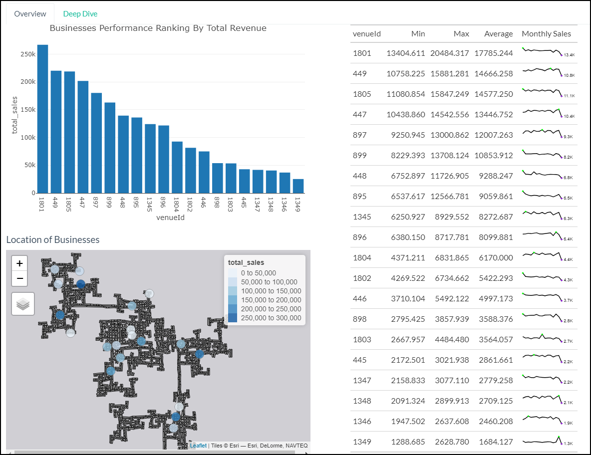
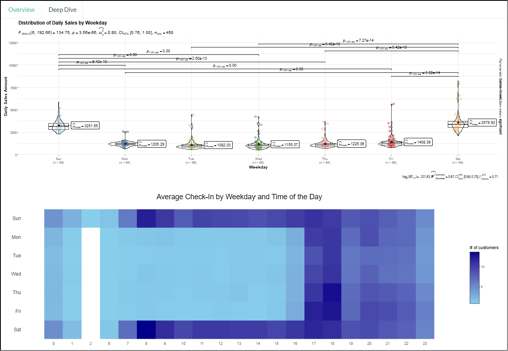
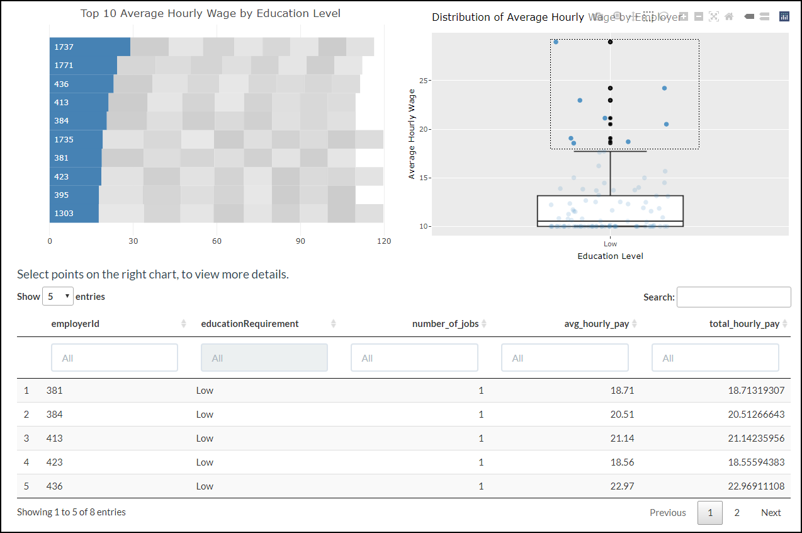
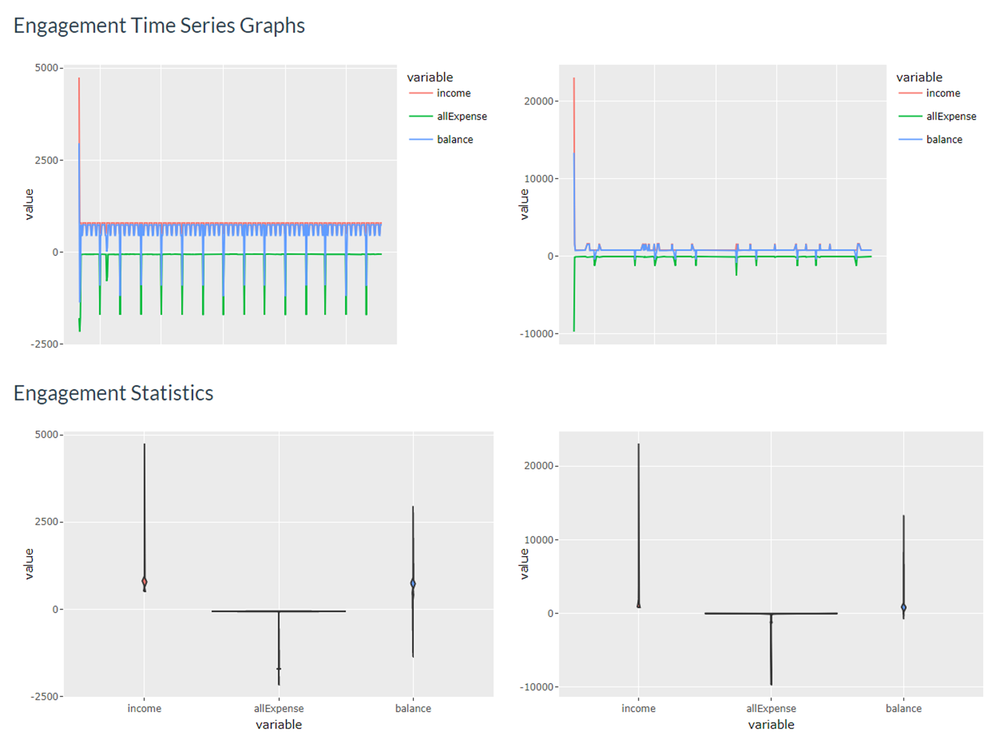
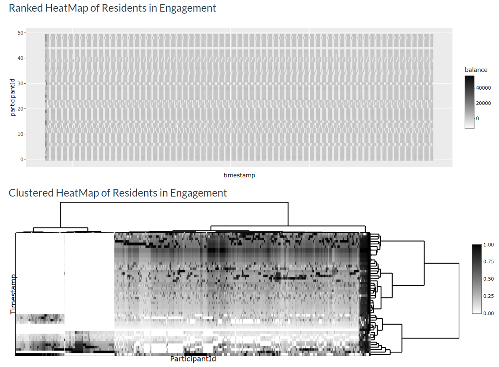
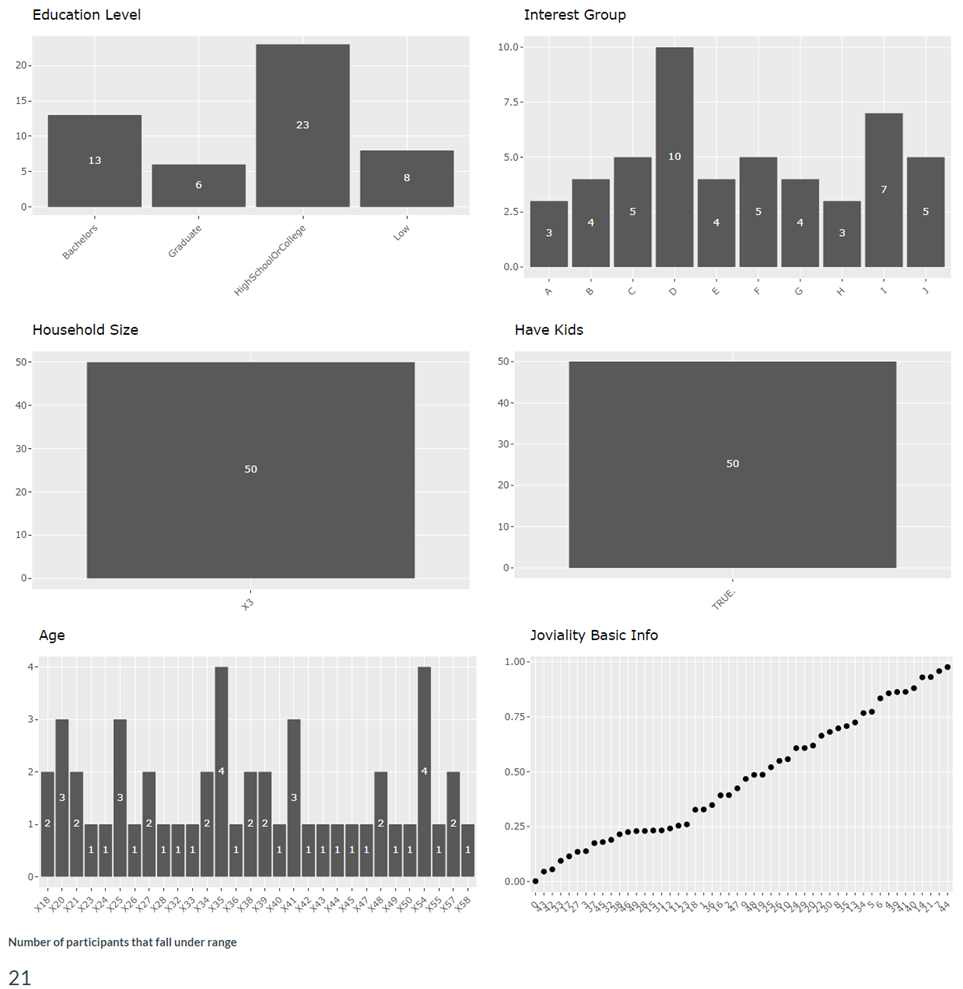

```{css, echo=FALSE}

div.title_container{
   height: 8%;
}

div.figure{
   text-align: center;
}

img {
    margin-top: 0;
   margin-bottom: 0;
   text-align: center;
}

p.caption{
   margin-top: 0;
   margin-bottom: 0;
   text-align: center;
}

div.poster_body{
   margin-top: 0;
   margin-bottom: 0;
}


```

```{r setup, include=FALSE}
knitr::opts_chunk$set(echo = FALSE,
                      warning = FALSE,
                      tidy = FALSE,
                      message = FALSE,
                      out.width = "100%")
```

# Introduction

We created an interactive dashboard that allows the user to visually analyse the economy of Engagement, a fictional city created for [2022 IEEE VAST Challenge](https://vast-challenge.github.io/2022/), and the interplay between its employees and employers to solve these questions - *Over time, are businesses growing or shrinking? Are standards of living improving or declining over time? How are people changing jobs?*

# Data Preparation

We use 11 of 13 data sets: *Participant StatusLogs, Apartments, Buildings, Employers, Jobs, Participants, Pubs, Restaurants, Schools, CheckinJournal and TravelJournal* that is charted from 2022-03-01T00:00:00Z to 2023-05-24T04:30:00Z for all 1010 participants who reside in Engagement. Our goal is to sieve out the key data points related to each of the questions mentioned above. 

To do that, tidyverse, dplyr, lubridate packages etc are used to prepare the datasets which are then saved into RDS or CSV formats in order to make retrieval easier. Lastly, we use the packages plotly, ggplot2, tmap, sf, rPackedBar, gt, and gtExtras etc to create data visualizations.

# Features

## Tab 1 - 'Business Performance'

In assessing which businesses within the city of Engagement are thriving, we consider two approaches by using the revenue generated and wages offered. Pubs and restaurants are two distinct businesses with participant's expenses data available. As such, the performance of pubs and restaurants is evaluated based on the accumulated sales. On the other hand, as wages are the only numeric data present for all employers, it will be the basis for comparing the financial prosperity of the employers.

Upon clicking on the 'Business Performance' tab, the user can further select 2 components to explore. They are (1) By Revenue and (2) By Wages.

**(1) By Revenue** Under the *By Revenue* section it is further divided into 2 sub-tabs, *Overview* and *Deep Dive*.

The *Overview* sub-tab provides an overall glance of the business performance of pubs and restaurants. Users first select either pubs or restaurants to see the ranking in terms of overall sales based on the filtered duration. The data found on the right part of the dashboard provides further insights on the sales performance of each business that falls under the selected category of pubs or restaurants arranged based on the average monthly sales in descending order. Users can also observe the monthly trend of each business through the sparklines available. Meanwhile, the map plot illuminates areas of the town where businesses are flourishing. 

{width="90%"}

The *Deep Dive* section allows user to explore on the sales performance of a selected business across the weekdays. In general, we observe that pubs tend to have higher sales and more visitors during the weekends. On the other hand, the heatmap plot reveals the peak timings of the 'Venue ID' selected.

{width="90%"}

**(2) By Wages** Users have the option to compare the average wages of the employers by filtering the education level. The packed bar charts showcase the top employers that offers the 10 highest average hourly wage by education level. The box plot depicts the distribution of the average hourly wage of all employers. User can select the points on the box plot to obtain additional details of the selected businesses such as the number of jobs offered for that particular education level.

{width="90%"}

## Tab 2 - 'Employees'

Upon clicking on the 'Employees' tab, the user can further select 3 components to explore. They are (1) Income and Expense, (2) Patterns with Heatmap and (3) Participant Breakdown.

**(1) Income and Expense** This tab starts the user off with a bird's eye view of *Engagement's* income and expenses over time. To do so, a line graph over time and allow the user to pick from 4 settings, "total", "average", "maximum" and "minimum", that provide the data that their names suggest. The user can then explore different participants individually with a degree of granularity. Both charts are placed side by side to make it easier for the user to compare the information. Violin plots are provided below both line graphs so that the users can understand the distribution and key statistical parts, such as average and spread, of both line graphs in an instance.

{width="90%"}

**(2) Patterns with Heatmap** A person's balance determines his or her financial health, and that is the base data set for this tab. The easiest way to find a pattern would be use a clustering algorithm on that data set, as demonstrated by the *Clustered Heatmap of Residents in Engagement.* To enhance instant explanability and derive preliminary results from the dashboard, user can also explore potential patterns throught the *Ranked Heatmap of Residents in Engagement.* when the participants are ranked based on their income, expense and balance.

{width="90%"}

**(3) Participant Breakdown** This tab provides the user with a quick overview of the personal information of participants he or she chooses either from the *Patterns with Heatmap* tab or by manually inputting up to 10 participant IDs to help explain the patterns observed.

{width="90%"}

## Tab 3 - 'Employers'

Upon clicking on the 'Employers' tab, the user can further select 2 components to explore. They are (1) Map View and (2) Turnover Rate.

**(1) Overview of Employers' Health** This tab allows users to study the employment numbers of all the employers in the city throughout the different selected time period. The map shows the locations of each employer and number of employees they employed while the statistical plot aims to show the distribution of the number of employees with the user selected variable. A datatable is also provided for user to understand further information of the selected employer. Various parameters (eg. hourly rate, hiring rate etc) are available for users to  understand further each employer's health. 

{width="90%"}

{width="90%"}

**(2) Turnover Rate** This tab zooms down to employees that have changed jobs and employers that have changed employees during the 15 month data collection period. The charts separate the employees into different education levels and whether they have kids. The statistical plots aims to allow users to generate insights on relations of other factors to turnover rate.

{width="90%"}

# Future Work and Conclusion

Given more data, we could have minimized the need to hypothesize and triangulate. For example, business expenses information would allow us to more accurately determine the growth of a business by comparing the profits and losses over time. Also, while the user guide and poster are useful, it would be best if we could present and demonstrate our solution in person as the former methods do not allow us to cater for and explain all the edge cases.

That being said, we believe that our solution paints a congruent enough information about the macro and granular details of the economy and its stakeholders, and would help the user understand the economy of Engagement.

<center>