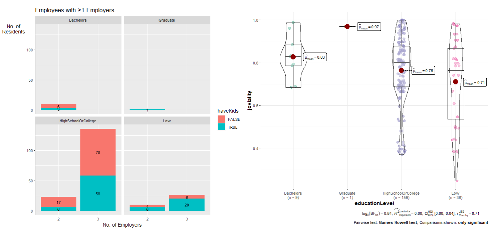

```{r setup, include=FALSE}
knitr::opts_chunk$set(echo = FALSE,
                      warning = FALSE,
                      tidy = FALSE,
                      message = FALSE,
                      fig.align = 'center',
                      out.width = "100%")
```

# Introduction

The first of its kind, this term’s ISSS608 Visual Analytics and Applications course led by Professor Kam Tin Seong builds us towards the highly prestigious IEEE Vast Challenge 2022.

There are 4 challenges provided, targeting different aspects of life in the fictional town Engagement. Our team chose to analyse the Economics of Engagement, and created an interactive dashboard that allows the user to visually analyse the interplay between employee (or residents) and business (or employers) in order to answer the questions: *Over time, are businesses growing or shrinking? How are people changing jobs? Are standards of living improving or declining over time?*

# Data Preparation

This year, the competition features the fictional town Engagement. We are given a total of 13 datasets comprising information from 2022-03-01T00:00:00Z to 2022-03-04T14:25:00Z about the 1010 participants who reside there. The team used 10 of these datasets for this project, and they are **Participant StatusLogs, Apartments, Buildings, Employers, Jobs, Participants, Pubs, Restaurants, Schools and CheckinJournal**.

We performed data wrangling and transformation to the datasets before loading them in the application. 

# Methodology

The application uses various packages such as tidyverse, plotly, ggplot2, lubridate, tmap, sf packages to conduct exploratory data analysis. 

# Features
The app consist of three tabs for users to explore the economy of Engagement City; (1) Business Performance, (2) Employees and (3) Employers.  

## Tab 1 - 'Business Performance'

The main objective of the first question in Challenge 3 is to identify which businesses are prospering or struggling. As there is no sales and expense data found on the `Restaurants.csv` and `Pubs.csv`, the only way to obtain sales volume is to compute via the customer's spending on these businesses.

Prosperous businesses will refer to companies that are making more sales whereas struggling businesses will refer to companies that have lower sales. As the sales volume fluctuates sporadically day-to-day, to determine the top 5 companies, the total overall sales are calculated and the 5 companies with the most sales are selected.

Upon clicking on the 'Business Performance' tab, the user can further select 2 components to explore. They are (1) By Revenue and (2) By Wages.

## Tab 2 - 'Employees'

Upon clicking on the 'Employees' tab, the user can further select 3 components to explore. They are (1) Income and Expense, (2) Patterns with Heatmap and (2) Participant Breakdown.


## Tab 3 - 'Employers'

Upon clicking on the 'Employers' tab, the user can further select 2 components to explore. They are (1) Map View and (2) Turnover Rate.

**(1) Overview of Employers' Health** Users can study the employment numbers throughout different time period of all the employers in the city via the map and datatable. The map shows the locations of each employer and number of employees they employed. The statistical plot aims to show the distribution of the number of employees with the user selected variable.     

{width=90%}

**(2) Turnover Rate** This tab zoomed down to employees that have changed jobs and employers that have changed employees during the 15 month data collection period. The charts separate the employees into different education levels and whether they have kids. The statistical plots aims to allow users to generate insights on relations of other factors to turnover rate.  

{width=90%}

<center>

# Conclusion

Try `posterdown` out! Hopefully you like it!

```{r, include=FALSE}
knitr::write_bib(c('knitr','rmarkdown','posterdown','pagedown'), 'packages.bib')
```

# References