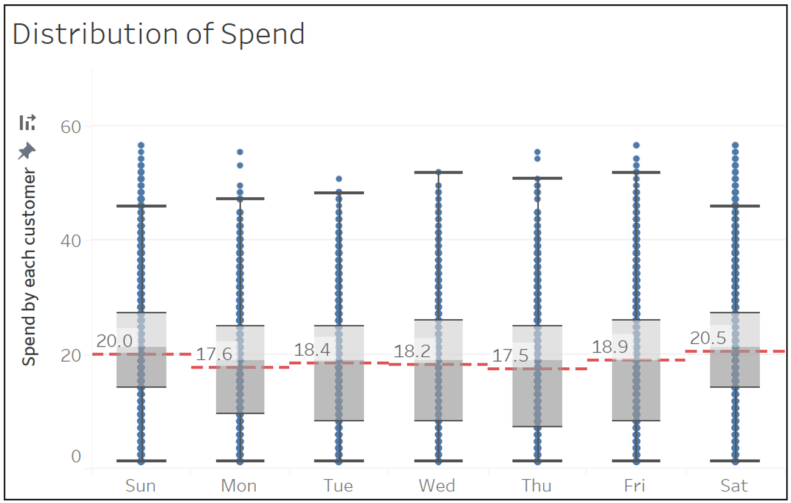

```{r setup, include=FALSE}
knitr::opts_chunk$set(echo = FALSE)
```

## Challenge Chosen

We chose Challenge 3 (Economics), and its accompanying sub-questions.

+---------------+-------------------------------------------------+
| Overarching   |                                                 |
| Question      |                                                 |
+===============+=================================================+
| \             | Over time, are businesses growing or shrinking? |
|               | How are people changing jobs? Are standards of  |
|               | living improving or declining over time?        |
+---------------+-------------------------------------------------+
| **Sub         | \                                               |
| -Questions**  |                                                 |
+---------------+-------------------------------------------------+
| 1             | Over the period covered by the dataset, which   |
|               | businesses appear to be more prosperous? Which  |
|               | appear to be struggling? Describe your          |
|               | rationale for your answers. Limit your response |
|               | to 10 images and 500 words.                     |
+---------------+-------------------------------------------------+
| 2             | How does the financial health of the residents  |
|               | change over the period covered by the dataset?  |
|               | How do wages compare to the overall cost of     |
|               | living in Engagement? Are there groups that     |
|               | appear to exhibit similar patterns? Describe    |
|               | your rationale for your answers. Limit your     |
|               | response to 10 images and 500 words.            |
+---------------+-------------------------------------------------+
| 3             | Describe the health of the various employers    |
|               | within the city limits. What employment         |
|               | patterns do you observe? Do you notice any      |
|               | areas of particularly high or low turnover?     |
|               | Limit your response to 10 images and 500 words. |
+---------------+-------------------------------------------------+

## Visualisation Solution


In order to visualise the changes systematically, we take a multi-prong
approach. More specifically, there are 4 "prongs" --- one to teach the
user how to use our app, and the rest for each question.

As seen above, all 4 prongs will be parked under a unifying dashboard,
with each prong being accessible by a tab. The questions will be
arranged sequentially, starting from the user menu (or introduction,
Sub-Question 1 (ie *Business Performance*), Sub-Question 2 (ie *Income
and Expense*) and Sub-Question 3 (ie *Employer*).

We arrange our tabs in this manner because we want to guide our user
into a top-down understanding of the economy in Engagement. using the
*Business Performance* tab. The user first learns about the business
ecosystem in Engagement. Using that information, he or she will be able
to make more informed exploratory decisions to understand the situation
from the employee, through the *Income and Expense* tab, and employer's,
through the *Employer* tab, perspectives.

### Sub-Question 1 - Business Performance

*Over the period covered by the dataset, which businesses appear to be
more prosperous? Which appear to be struggling? Describe your rationale
for your answers.*


We use 2 sub-tabs to answer this - *Pubs & Restaurants* and
*Workplaces.*

####  


The *Pubs & Restaurants* tab has 7 parts.

1.  The controller that allows the user to interact with the different
    plots and graphs.
2.  A bar graph displaying the top overall performing businesses in
    Engagement.
3.  A line graph that shows the monthly sales of different venues over
    time.
4.  A map that shows the total sales by venue id.
5.  A scatter plot demonstrating the cumulative sales by different
    visitors.
6.  A violin-and-boxplot that shows the statistical distribution of
    weekend sales.
7.  A heatmap that displays the frequency of check-ins by days in the
    week and time of the day.

#### 1. Control

The 4 features in which users can play around with are as follows.

+---------------+-----------------------------------------------------------+
| Feature       | Function                                                  |
+===============+===========================================================+
| Category      | User has the option to view either restaurants or pubs.   |
| (Radio        |                                                           |
| button)       |                                                           |
+---------------+-----------------------------------------------------------+
| Scenario      | User can select the type of scenario they would like to   |
| (Dropdown)    | visualize. Select 'Top 5' or 'Top 10' to view the top 5   |
|               | or top 10 businesses to see which companies are           |
|               | prospering.                                               |
+---------------+-----------------------------------------------------------+
| Date (Range   | User has the ability to scope to the target range date.   |
| Slider)       |                                                           |
+---------------+-----------------------------------------------------------+

#### 2. Top Overall Performing Business


The main objective of the first question in challenge 3 is to identify
which businesses are prospering or struggling. As there is no sales and
expense data found on the `Restaurants.csv` and `Pubs.csv`, the only way
to obtain sales volume is to compute via the customer's spending on
these businesses. Prosperous businesses will refer to companies that are
making more sales whereas struggling businesses will refer to companies
that have lower sales. As the sales volume fluctuates sporadically
day-to-day, to determine the top 5 companies, the total overall sales
are calculated and the 5 companies with the most sales are selected.

#### 3. Monthly Sales


As the *Total Sales Chart* only compares at the overall sales volume, it
provides no insights on how the businesses are performing overtime.
Therefore, the Monthly Sales chart visualizes how the companies are
performing at a monthly basis. We see that in general, there is a sharp
decline in sales from March 2022 to April 2022. Businesses continues to
dip till June 2022 after which the sales fluctuates.

#### 4. Total Sales by VenueId

{width="666"}

\*\*Please fill in.

#### 5. Cumulative Sales By Cumulative Visitors

{width="675"}

\*\*Please fill in.

#### 6. Distribution of Weekly Sales



To give insights to users on the weekday sales of the selected
businesses. Are customers spending more on the weekday or the weekends?

#### 7. Check-in By Weekday and Time of Day


The Occupancy Heatmap provides vizualisation on the average occupancy
rate for the selected company across the weekdays at hourly intervals.
Users are able to see which are the peak and non-peak periods.

#### Tab 2 - Workplaces


The *Workplaces* tab has 3 parts.

1.  The controller that allows the user to interact with the different
    plots and graphs.
2.  A bar graph displaying the total wages paid by an employer.
3.  A line graph that shows the monthly total wages paid by an employer
    over time.

#### 1. Control


\*\* Please fill in

#### 2. Bar Graph of Total Wages


\*\* Please fill in.

#### 3. Line Chart of Monthly Total Wages


\*\* Please fill in.

### Sub-Question 2

*How does the financial health of the residents change over the period
covered by the dataset? How do wages compare to the overall cost of
living in Engagement? Are there groups that appear to exhibit similar
patterns? Describe your rationale for your answers. Limit your response
to 10 images and 500 words.*


We use 3 sub-tabs to answer this - *Income and Expense, Patterns with
Heatmap* and *Participant Breakdown.*

#### Tab 1 - Income and Expense


The *Income and Expense* tab has 7 parts.

1.  The controller that allows the user to interact with the different
    plots and graphs.
2.  A line graph for Engagement.
3.  A line graph for an individual.
4.  A violin plot for Engagement.
5.  A violin plot for individual.

#### 1. Control


There are 3 parts to the controller. The first part allows me to select
the time range, as well as the time divisions (daily, weekly etc) to be
used for evaluation.

The second one allows us to decide what income and expense to evaluate
for Engagement. On top of that, it allows us to evaluate the total,
average, maximum and minimum value for each time division.

The last one allows the user to evaulate an individual participant's
income and expenses. This allows us to either evaluate the individual
alone, or compare him or her to the general performance in Engagement.

#### 2 + 3. Line Graphs


This allows the user to track subtle differences in income, total
expenses and sub-expenses over time and answers the first 2
sub-questions.

#### 4 + 5. Violin Plots


While the line graph is great, it does not encapsulate any statistical
information. 

We gather such information for the chosen income and expenses for both
Engagement and the individual chosen with a violin plot. This way, we
get to see the distribution, as well as the mean and variance in the
different parameters.

#### Tab 2 -Patterns with Heatmap

The *Patterns with Heatmap* tab has 2
parts.

1.  The controller that allows the user to interact with the different
    plots and graphs.
2.  A heatmap representing the balance of individuals in Engagement.

#### 1 - Control

{width="678"}

The controller allows us to choose the date range and the time division
to evaluate. In order to seek a "pattern", we let the user rank the
participants based on a certain factor. The user can do this ascendingly
or descendingly. Lastly, we allow the user to explore different ranges
of people, from the top 50 all the way to the 237th member ranked.

#### 2 - Heatmap


Each row in the heat map represents a participant. Each column in the
heat map represents a time period. To adjust the number of participants
in the heat map, we can use the "Top X filter" in the Heat Map
Controller. 

More importantly, the magnitude of the colour is representative of the
amount of balance or debt. For example, a participant with more debt in
a certain time period will have a denser red-coloured grid than a user
with less debt.

#### Tab 3 -Participant Breakdown


The *Participant Breakdown* tab has 2 large parts.

1.  The controller that allows the user to interact with the different
    plots and graphs.
2.  May other barplots that represent the basic traits of the
    participants chosen in the previous heatmap.

#### 1 - Control


The barplots will naturally changes according to the decisions we made
in the previous heatmap. We also allow the user to customise the group
of people he or she wants to evaluate by letting them manually input the
id of those participants.

#### 2 - Barplots of Traits Representative of Participant


The heatmap is helpful for pattern recognition. The traits highlighted
here allow us to explain those patterns.

### Sub-Question 3

*Describe the health of the various employers within the city limits.
What employment patterns do you observe? Do you notice any areas of
particularly high or low turnover?*


We use 3 sub-tabs to answer this - *Map View, Hiring Rate* and *Turnover
Rate.*

#### Tab 1 - Map View


The *Income and Expense* tab has 7 parts.

1.  The controller that allows the user to interact with the different
    plots and graphs.
2.  A map that shows the location and number of employees employed by
    the employer.
3.  A database with information on each employer.

#### 1 - Control


The user is allowed to choose the type of employer to evaulate.

#### 2 - Map


We then display a map of the city, and the number of employers in each
company. This way, the user might be able to look beyond the company and
see how different employers interact.

#### 3 - Data 


Extra data is provided to help the user find patterns.

#### Tab 2 - Hiring Rate

#### Tab 3 - Turnover Rate

## Proposed Packages

These are the R packages we are planning on using. This is subject to
change as the requirements of the project from our end might change.

+-----------------------+---------------------------------------+
| Package Name          | Use                                   |
+=======================+=======================================+
| shiny and shiny       | To build an interactive web           |
| dashboard             | visualisation.                        |
+-----------------------+---------------------------------------+
| shinythemes           | To make our shiny website more        |
|                       | aesthetic.                            |
+-----------------------+---------------------------------------+
| tidyverse             | A must-have for data manipulation and |
|                       | exploration.                          |
+-----------------------+---------------------------------------+
| plotly                | To create all bar charts and graphs.  |
+-----------------------+---------------------------------------+
| ggplot2               | To plot our visualisations and        |
|                       | conduct Exploratory Data Analysis.    |
+-----------------------+---------------------------------------+
| treemap               | To display hierarchical data as a set |
|                       | of nested rectangles.                 |
+-----------------------+---------------------------------------+
| ggrepel               | To repel overlapping text labels away |
|                       | from each other and away from the     |
|                       | data points that they label.          |
+-----------------------+---------------------------------------+
| lubridate             | To make it easier to work with dates  |
|                       | and times.                            |
+-----------------------+---------------------------------------+
| gapminder             | \                                     |
+-----------------------+---------------------------------------+
| gganimate             | To create animated ggplots.           |
+-----------------------+---------------------------------------+
| ggiraph               | To create dynamic ggplot graphs.      |
+-----------------------+---------------------------------------+
