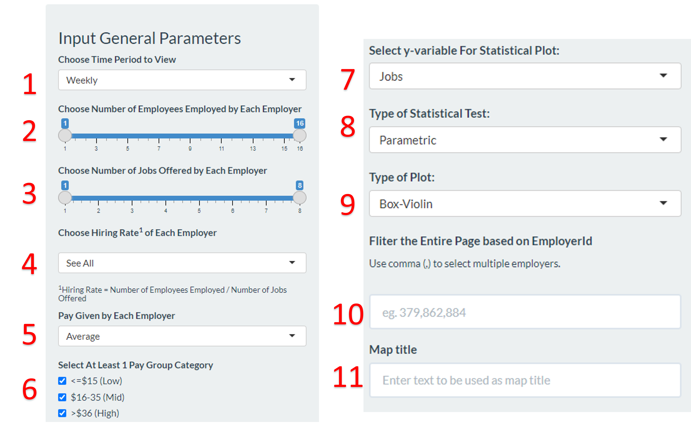

```{r setup, include=FALSE}
knitr::opts_chunk$set(echo = FALSE,fig.align="center")
```

# Challenge Chosen

We chose Challenge 3 (Economics), and its accompanying sub-questions.

+----------------------+----------------------------------------------+
| Overarching Question |                                              |
+======================+==============================================+
| \                    | Over time, are businesses growing or         |
|                      | shrinking? How are people changing jobs? Are |
|                      | standards of living improving or declining   |
|                      | over time?                                   |
+----------------------+----------------------------------------------+
| **Sub -Questions**   | \                                            |
+----------------------+----------------------------------------------+
| 1                    | Over the period covered by the dataset,      |
|                      | which businesses appear to be more           |
|                      | prosperous? Which appear to be struggling?   |
|                      | Describe your rationale for your answers.    |
|                      | Limit your response to 10 images and 500     |
|                      | words.                                       |
+----------------------+----------------------------------------------+
| 2                    | How does the financial health of the         |
|                      | residents change over the period covered by  |
|                      | the dataset? How do wages compare to the     |
|                      | overall cost of living in Engagement? Are    |
|                      | there groups that appear to exhibit similar  |
|                      | patterns? Describe your rationale for your   |
|                      | answers. Limit your response to 10 images    |
|                      | and 500 words.                               |
+----------------------+----------------------------------------------+
| 3                    | Describe the health of the various employers |
|                      | within the city limits. What employment      |
|                      | patterns do you observe? Do you notice any   |
|                      | areas of particularly high or low turnover?  |
|                      | Limit your response to 10 images and 500     |
|                      | words.                                       |
+----------------------+----------------------------------------------+

# Visualisation Solution


In order to visualise the changes systematically, we take a multi-prong
approach. More specifically, there are 4 "prongs" --- one to teach the
user how to use our app, and the rest for each question.

As seen above, all 4 prongs will be parked under a unifying dashboard,
with each prong being accessible by a tab. The questions will be
arranged sequentially, starting from the user menu (or introduction,
Sub-Question 1 (ie *Business Performance*), Sub-Question 2 (ie *Employee*) and Sub-Question 3 (ie *Employer*).

We arrange our tabs in this manner to guide user into a top-down understanding of the economy in Engagement. The user first learns about the business ecosystem in Engagement using the *Business Performance* tab. Using that information, user will be able to make informed exploratory decisions to understand the situation from the employee, through the *Income and Expense* tab, and employer's,
through the *Employer* tab, perspectives.

# Business Performance

*Over the period covered by the dataset, which businesses appear to be
more prosperous? Which appear to be struggling? Describe your rationale
for your answers.*


We use 2 sub-tabs to answer this - *By Revenue* and *By Wages*.

## The 'By Revenue' Tab

This tab has 7 parts: 

1.  The controller that allows the user to interact with the different
    plots and graphs.
2.  A bar graph displaying the ranking of businesses by total revenue in city 
    of Engagement.
3.  A data table and sparklines that shows the monthly sales trend of businesses 
    over time.
4.  A map that shows the total sales by venue id.
5.  A violin-and-boxplot that shows the statistical distribution of
    daily sales across the weekdays.
6.  A heatmap that displays the frequency of check-ins by days in the
    week and time of the day.

### 1. Control

The 4 features in which users can play around with are as follows.

| Feature                 | Function                                                                                                                                                                    |
|-------------------------|-----------------------------------------------------------------------------------------------------------------------------------------------------------------------------|
| Category (Radio button) | User has the option to view either restaurants or pubs.                                                                                                                     
| Date (Range Slider)     | User has the ability to scope to the target range date.                |

|

### 2. Top Overall Performing Business


The main objective of the first question in challenge 3 is to identify
which businesses are prospering or struggling. As there is no sales and
expense data found on the `Restaurants.csv` and `Pubs.csv`, the only way
to obtain sales volume is to compute via the customer's spending on
these businesses. Prosperous businesses will refer to companies that are
making more sales whereas struggling businesses will refer to companies
that have lower sales. As the sales volume fluctuates sporadically
day-to-day, to determine the top 5 companies, the total overall sales
are calculated and the 5 companies with the most sales are selected.

### 3. Monthly Sales Trend and Distribution


As the businesses in the *Business Performance Ranking Chart* are compared based 
on the overall sales accumulated, it provides no insights on how the 
businesses are performing overtime. Thus, the data table and sparklines chart 
is displayed to reveal the monthly sales trend and provide the lowest and 
highest revenue generated. We observe that in general, there is a sharp decline 
in sales from March 2022 to April 2022. Businesses continue to deteriorate till 
June 2022 after which the sales fluctuates.

### 4. Business Performance by Location


The map plot enables users to explore and identify if there are any patterns in 
terms of business performance based on the location of the pubs or restaurants.

### 5. Distribution of Weekly Sales


To give insights to users on the weekday sales of the selected
businesses. Are customers spending more on the weekday or the weekends?

### 7. Check-in By Weekday and Time of Day


The *Average Check-In by Weekday and Time of the Day* Heatmap provides 
vizualisation on the average visitors for the selected company across the 
weekdays at hourly intervals. the chart can be used to examine the peak and 
non-peak periods of the selected businesses.

## The 'By Wages' Tab


This tab has 3 parts.

1.  The controller that allows the user to interact with the different
    plots and graphs.
2.  A bar graph displaying the total wages paid by an employer.
3.  A line graph that shows the monthly total wages paid by an employer
    over time.

### 1. Control


\*\* Please fill in

### 2. Packed Bar Chart of Average Hourly Wage


### 3. Line Chart of Monthly Total Wages


\*\* Please fill in.

### 4. Line Chart of Monthly Total Wages


# Employees

*How does the financial health of the residents change over the period
covered by the dataset? How do wages compare to the overall cost of
living in Engagement? Are there groups that appear to exhibit similar
patterns? Describe your rationale for your answers. Limit your response
to 10 images and 500 words.*

 We use 3 sub-tabs to answer this -
*Income and Expense, Patterns with Heatmap* and *Participant Breakdown.*

## The 'Income and Expense' Tab


This has 7 parts.

1.  The controller that allows the user to interact with the different
    plots and graphs.
2.  A line graph for Engagement.
3.  A line graph for an individual.
4.  A violin plot for Engagement.
5.  A violin plot for individual.

### 1. Control


There are 3 parts to the controller. The first part allows me to select
the time range, as well as the time divisions (daily, weekly etc) to be
used for evaluation.

The second one allows us to decide what income and expense to evaluate
for Engagement. On top of that, it allows us to evaluate the total,
average, maximum and minimum value for each time division.

The last one allows the user to evaluate an individual participant's
income and expenses. This allows us to either evaluate the individual
alone, or compare him or her to the general performance in Engagement.

### 2 + 3. Line Graphs


This allows the user to track subtle differences in income, total
expenses and sub-expenses over time and answers the first 2
sub-questions.

### 4 + 5. Violin Plots


While the line graph is great, it does not encapsulate any statistical
information. 

We gather such information for the chosen income and expenses for both
Engagement and the individual chosen with a violin plot. This way, we
get to see the distribution, as well as the mean and variance in the
different parameters.

## The 'Patterns with Heatmap' Tab

The *Patterns with Heatmap* tab has 2
parts.

1.  The controller that allows the user to interact with the different
    plots and graphs.
2.  A heatmap representing the balance of individuals in Engagement.

### 1 - Control

{width="678"}

The controller allows us to choose the date range and the time division
to evaluate. In order to seek a "pattern", we let the user rank the
participants based on a certain factor. The user can do this ascendingly
or descendingly. Lastly, we allow the user to explore different ranges
of people, from the top 50 all the way to the 237th member ranked.

### 2 - Heatmap


Each row in the heat map represents a participant. Each column in the
heat map represents a time period. To adjust the number of participants
in the heat map, we can use the "Top X filter" in the Heat Map
Controller. 

More importantly, the magnitude of the colour is representative of the
amount of balance or debt. For example, a participant with more debt in
a certain time period will have a denser red-coloured grid than a user
with less debt.

## The 'Employee Breakdown' Tab


The *Employee Breakdown* tab has 2 large parts.

1.  The controller that allows the user to interact with the different
    plots and graphs.
2.  May other barplots that represent the basic traits of the
    participants chosen in the previous heatmap.

### 1 - Control


The barplots will naturally changes according to the decisions we made
in the previous heatmap. We also allow the user to customise the group
of people he or she wants to evaluate by letting them manually input the
id of those participants.

### 2 - Barplots of Traits Representative of Participant


The heatmap is helpful for pattern recognition. The traits highlighted
here allow us to explain those patterns.

# Employer

*Describe the health of the various employers within the city limits.
What employment patterns do you observe? Do you notice any areas of
particularly high or low turnover?*


We use 2 sub-tabs to answer this - *Map View* and *Turnover Rate*.

## The 'Map View' Tab


This tab has 4 parts.

1.  The controller with 11 parameters that allows the user to interact with the map, plot and data table.
2.  A map that shows the location and number of employees employed by the employer.
3.  A plot that shows distribution of employees employed by each employer with a selected factor.
4.  A datatable with information on each employer such as the number of employees and jobs they have, the pay ranges and hiring rate.

### 1 - Control


The entire tab will be updated accordingly to the parameters chosen. If there is no data from the selected parameters, an error message will be reflected: 

{height="80" width=40%}

1. User can choose 'Daily', 'Weekly', 'Monthly' or 'Weekday' time period to view, the default selection is 'Weekly'.

2. User can select the range or specific number of employees employed by each employer, the default selection is to show all employees under each employer. 

3. User can select the range or specific number of jobs offered by each employer.

4. User can select the hiring rate of each employer. Hiring rate is defined as the Number of Employees Employed divide by Number of Jobs Offered. 

5. This shows the minimum, maximum, average and median hourly rate pay across all jobs under each employer. User can choose the computation; the default selection is average pay. 

6. User can select the pay group category, the default selection is to show all groups. 

7. This control the y variable of the statistical plot which is defaulted at the "Number of Jobs offered by each employer", the x variable is fixed at the number of employees employed by each employer. 

8. User can specify the statistical test that he/she wishes to see. The default selection is parametic test.

9. User can specify the type of plot he/she wishes to see for the statistical plot.The default selection is box-violin plot. 

10. User can filter the entire tab based on 'EmployerId'. To see more than one employer, user is to add a comma after each ID eg. 379,862,884. 

11. User can key in any text which will be auto updated as title above the map. 

### 2 - Map

A map of the city is displayed on the left, with a legend showing the number of employers in each
company. User can hover to the bubbles to see the respective employerId. This way, the user might be able to look beyond the company and see how different employers interact.

On the right is the statistical plot that shows the distribution of number of the employees employed. 


### 3 - Data table

User can filter the table via the input field at the bottom of each column. This serves to provide more information to help the user find patterns.


## The 'Turnover Rate' tab  

This tab has 3 parts.

1.  The controller with 7 parameters that allow user to filter the plots.
2.  The facet plots that classified the employees into different educational level and show whether they have kids.
3.  The statistical plot that shows distribution of selected variables. 
 
The datasets used for this tab are already filtered to only 1) employers with the number of different employees and 2) employees that has more than one employer during the 15 month data collection period. 

 

### 1 - Control

{height="400" width=40%}

1. User can choose the 'Date', 'Week' or 'Month' or 'Weekday' to see the time period where there are changes to the employees/employers. 

2. User can further refine to specific time period eg. specific date, week number or month to see the change to the employees/employers. 

3.  User can choose the x and y variable of the statistical plot. The default selection is "Educational Level" as x variable and "Joviality" as y variable. 

8. User can specify the statistical test that he/she wishes to see. The default selection is parametic test.

5. User can specify the type of plot he/she wishes to see for the statistical plot.The default selection is box-violin plot. 

6. User can key in any text and click the "Update Title" button to customize the page title.  

### 2 - Plots

The plots displayed on the left shows employers with the number of different employees during the selected time period. 

 
The plots displayed on the right shows employees that has more than one employer during the selected time period. 


 
