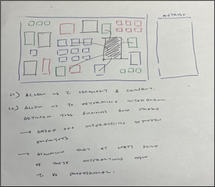
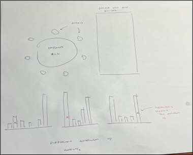
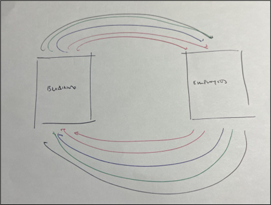

```{r setup, include=FALSE}
knitr::opts_chunk$set(echo = FALSE)
```

# Project Topic

This term the topic of [Visual Analytics Project](https://isss608-ay2021-22april.netlify.app/vaproject) will be based on VAST Challenge 2022. There are three challenges provided. Teams are required to choose one of the Challenge and build a Shiny Application to answer the questions of the Challenge.

Our group has chosen [Challenge 3 (Economic)](https://vast-challenge.github.io/2022/) for the project. In the subsequent sections, our team will briefly state the approach of the challenge including the graphical methods and r packages we intend to use.  


# Challenge 3
```{r, echo=FALSE}
knitr::include_graphics("C3.jpg")
```
## Question 1

What are the sales of pubs and restaurants over time?
●	Spending = business. 
●	Travel Journal, to find out how much the participants are spending at pubs and restaurants; group by the date to establish their sales over time. 
Are they operating at maximum capacity? 
●	Checkin Journal, to compute their occupancy rate within the day and week, to see their peak/off peak hour business. [heatmap] We can also compute the average time and spending of their customers
What are the companies’ profitability over time? [Related to Qns 3] 
●	Jobs, to categories the companies based on the type of employees (educational level) they hire 
●	Jobs, to compute the wages per headcount 
●	Compare the wages given by each employer over time 
●	Could we also categorise the companies based on the type of employees they have (e.g. blue-collar, white-collar)
How are the businesses affecting each other? 
●	Network analysis to see their interaction within the day? Within the week? 

```{r, echo=FALSE, out.width = '100%'}

```

## Question 2
What is the income distribution of the participants, how does it change over time and within different groups (age, interest group, household size, education)? 
What is the cost of living (on Food, travel, housing, education, leisure) vs income, how did it change over time and within different income groups?

How many people across the different categories of financial status (eg. unstable), and what is their range of food, spending budget?
●	ParticipantStatusLogs, dailyFoodBudget, weeklyExtraBudget
●	Savings of the participants 
What is the unemployment rate (see within age group, education level group)?
●	Checkin, to see who goes to work 

What is the population density of various apartment types (i.e. identify luxury zone based on rental cost) across the city
●	Apartments, to categories based on rental cost  

```{r, echo=FALSE, out.width = '100%'}

```

## Question 3

How many employers are there? How big are these companies? [Related 
Qns 1 - Companies Profitability] 
●	Jobs, to compute the jobs offered by each employers and wages range 
Where are they located? [Related Qns 2 - Luxury zone]
●	Employers, Buildings, to see their locations, co-location 
●	Could we apply certain architectural heuristics (e.g. the central region of any country tends to be the Central Business District, since it is more convenient for people to get there) 
What is the job supply and demand? 
●	Jobs, to compute the no. of job groups by education level, and compare with Participants’ education to see if any gap needs to be addressed?

Do participants change jobs over time? How does the employment rate change over time (Percentile – 100%) / turnover rate? What do we set as the benchmark unemployment rate? Is there any country that we can build this off? Perhaps we should make this an input as well
●	Checkin, if they go to work
●	Changes in the participants ID under each employer in that given month 
●	Assumption: no sick leave, no annual leave

```{r, echo=FALSE, out.width = '100%'}

```

