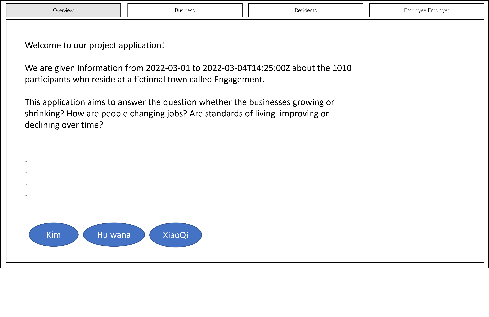
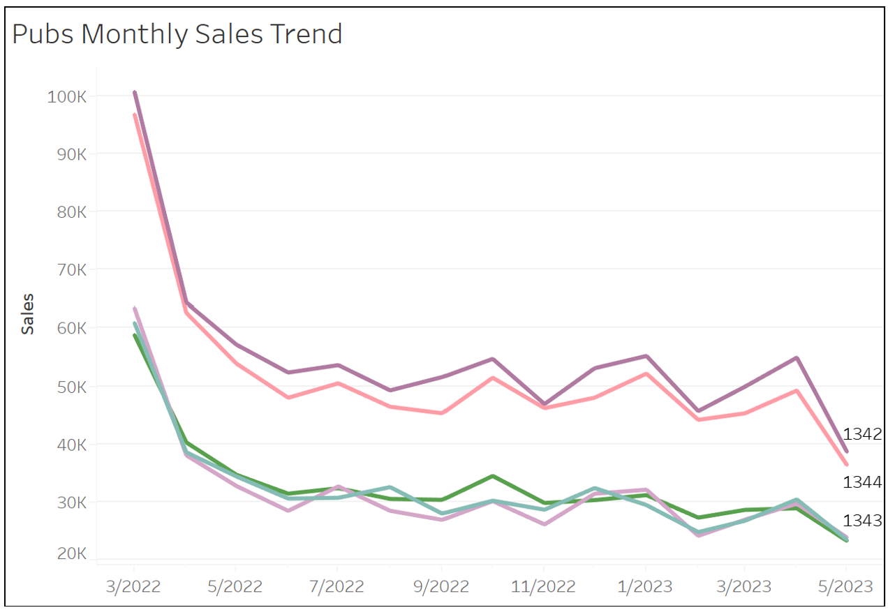
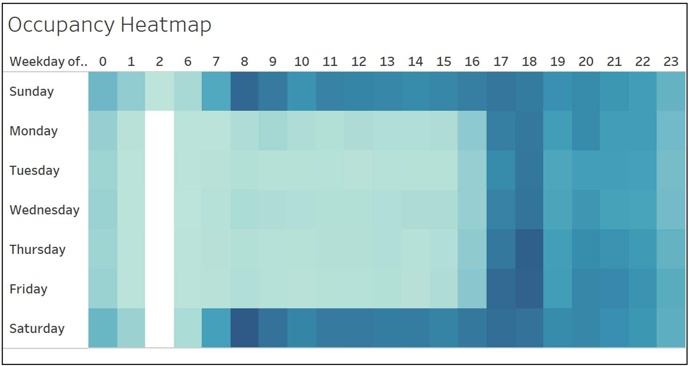
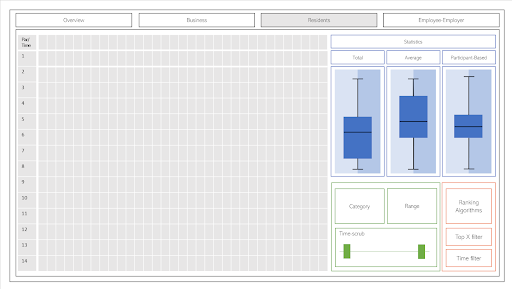

```{r setup, include=FALSE}
knitr::opts_chunk$set(echo = FALSE)
```

# Introduction

The first of its kind, this term's ISSS608 Visual Analytics and
Applications course led by [Professor Kam Tin
Seong](link%20to%20about%20us%20page) builds us towards the highly
prestigious [IEEE Vast Challenge
2022](https://vast-challenge.github.io/2022/).

There are 4 challenges provided, targeting different aspects of life in
the fictional town *Engagement*. Each team is to choose one challenge to
create a visualisation solution that will be hosted on a web application
using the R package - [Shiny](https://shiny.rstudio.com/). We chose to
analyse the Economics of Engagement, and created a dashboard that allows
the user to visually analyse the interplay between employee (or
residents) and business (or employers) before delving deeply into
exploring either.

# Brief Information About Competition

This year, the competition features the fictional town *Engagement*. We
are given information from *2022-03-01T00:00:00Z* to
*2022-03-04T14:25:00Z* about the 1010 participants who reside there.

## Datasets

In general, there are 13 datasets.

+------------+----------------+--------------------------------------+
|            | Dataset        | Description                          |
+============+================+======================================+
| 1          | Participant    | A collection of 72 Comma-Separated   |
|            | StatusLogs     | Values (CSV) files, each containing  |
|            |                | information about all participants'  |
|            |                | day-to-day activities. Each CSV file |
|            |                | contains information about the       |
|            |                | participant's current location,      |
|            |                | hunger status, sleep status,         |
|            |                | apartment, available balance, job,   |
|            |                | financial status, daily food budget  |
|            |                | and extra weekly budget.             |
+------------+----------------+--------------------------------------+
| 2          | Apartments     | Information about the rental cost,   |
|            |                | max occupancy, number of rooms, and  |
|            |                | location of buildings in             |
|            |                | Engagement.                          |
+------------+----------------+--------------------------------------+
| 3          | Buildings      | Information about the location,      |
|            |                | types and maximum occupancy of       |
|            |                | buildings in Engagement.             |
+------------+----------------+--------------------------------------+
| 4          | Employers      | Information about the location of    |
|            |                | employers in Engagement.             |
+------------+----------------+--------------------------------------+
| 5          | Jobs           | Information about employers, hourly  |
|            |                | rate, start time, end time, days to  |
|            |                | work and education requirements that |
|            |                | employees in Engagement have to      |
|            |                | meet.                                |
+------------+----------------+--------------------------------------+
| 6          | Participants   | Overarching information about each   |
|            |                | participant, including household     |
|            |                | size, whether they have kids, age,   |
|            |                | education levels, interest groups    |
|            |                | and joviality.                       |
+------------+----------------+--------------------------------------+
| 7          | Pubs           | Information about the hourly cost of |
|            |                | operation, mac occupancy and         |
|            |                | location of pubs in Engagement.      |
+------------+----------------+--------------------------------------+
| 8          | Restaurants    | Information about the cost of food,  |
|            |                | maximum occupancy and location of    |
|            |                | restaurants in Engagement.           |
+------------+----------------+--------------------------------------+
| 9          | Schools        | Information about the monthly costs, |
|            |                | maximum enrollment and location of   |
|            |                | schools in Engagement.               |
+------------+----------------+--------------------------------------+
| 10         | CheckinJournal | Information about the time           |
|            |                | participants check into different    |
|            |                | venues in Engagement.                |
+------------+----------------+--------------------------------------+
| 11         | Financial      | Information about the time and       |
|            | Journal        | amount participants spend on certain |
|            |                | types of items (ie Education, Food,  |
|            |                | Recreation, Rent Adjustment, Shelter |
|            |                | and Wage)                            |
+------------+----------------+--------------------------------------+
| 12         | SocialNetwork  | Information about the interaction    |
|            |                | between 2 participants in            |
|            |                | Engagement.                          |
+------------+----------------+--------------------------------------+
| 13         | TravelJournal  | Information about the all travel     |
|            |                | start and end time and duration,     |
|            |                | their purpose, the check-in and      |
|            |                | check-out timing associated with     |
|            |                | such travel, and the amount a        |
|            |                | participant starts and ends off with |
|            |                | during such travel.                  |
+------------+----------------+--------------------------------------+

## Challenges

There were 4 challenges provided. Each one asks us to choose a
perspective to evaluate Engagement by.

They are:

1.  Demographics and Relationships

2.  Patterns of Life

3.  Economic

4.  Combining analysis from Challenges 1 to 3

# Project Requirements

## Challenge Chosen

We chose Challenge 3 (Economics), and its accompanying sub-questions.

+--------------+-----------------------------------------------------+
| Overarching  |                                                     |
| Question     |                                                     |
+==============+=====================================================+
| \            | Over time, are businesses growing or shrinking? How |
|              | are people changing jobs? Are standards of living   |
|              | improving or declining over time?                   |
+--------------+-----------------------------------------------------+
| **Sub        | \                                                   |
| -Questions** |                                                     |
+--------------+-----------------------------------------------------+
| 1            | Over the period covered by the dataset, which       |
|              | businesses appear to be more prosperous? Which      |
|              | appear to be struggling? Describe your rationale    |
|              | for your answers. Limit your response to 10 images  |
|              | and 500 words.                                      |
+--------------+-----------------------------------------------------+
| 2            | How does the financial health of the residents      |
|              | change over the period covered by the dataset? How  |
|              | do wages compare to the overall cost of living in   |
|              | Engagement? Are there groups that appear to exhibit |
|              | similar patterns? Describe your rationale for your  |
|              | answers. Limit your response to 10 images and 500   |
|              | words.                                              |
+--------------+-----------------------------------------------------+
| 3            | Describe the health of the various employers within |
|              | the city limits. What employment patterns do you    |
|              | observe? Do you notice any areas of particularly    |
|              | high or low turnover? Limit your response to 10     |
|              | images and 500 words.                               |
+--------------+-----------------------------------------------------+

## Visualisation Solution

In order to visualise the changes systematically, we take a multi-prong
approach. More specifically, there are 4 "prongs" --- one for each
question. All 4 prongs will be parked under a unifying dashboard, with
each prong being accessible by a tab. The questions will be arranged
sequentially, starting from Overarching Questions (ie Overview),
Sub-Question 1 (ie Business), Sub-Question 2 (ie Residents) and
Sub-Question 3 (ie Employee-Employer).

We arrange our tabs in this manner because we want to guide our user
into a top-down understanding of the Economic in Engagement. The
Overview tab provides the user with a general understanding of the
economic situation in Engagement. Using the insight he or she gathered
and the hypotheses created during, the user then explores the business
and employee (or residents) side individually. With that new-found
knowledge, he or she can check out the relationship between employee and
employer (or business) to develop a full understanding of Engagement's
economy.

### Overview

This will be the landing page for all users where they find out more about the Vast Challange 3 and user instructions to navigate through the shiny app application.

We will also include short profile of each member. 



### Sub-Question 1

Over the period covered by the dataset, which businesses appear to be
more prosperous? Which appear to be struggling? Describe your rationale
for your answers.

Upon clicking on the 'Business' tab, the following default view will be 
displayed.


The 3 features in which users can play around with are 

+------------+-----------------------------------------+
| Feature    |  Function                               |
+============+=========================================+
| Category   |  User has the option to view either     |
| (Radio     |  restaurants or pubs.                   |
| button)    |                                         |
|            |                                         |
+------------+-----------------------------------------+
| Scenario   |  User can select the type of scenario   |
| (Dropdown) |  they would like to visualize.          |
|            |  Select 'Top 5' or 'Top 10' to view     |
|            |  the top 5 or top 10 businesses to see  |
|            |  which companies are prospering.        |
+------------+-----------------------------------------+
| Date       | User has the ability to scope to the    |
| (Range     | target range date.                      |
| Slider)    |                                         |
+------------+-----------------------------------------+

When the user clicked on a particular bar chart, the corresponding line chart to
its right will be highlighted. This action of clicking on the bar chart will also
result in 2 more charts to appear, a boxplot and a heatmap.


### Rationale

**Total Sales**


The main objective of the first question in challenge 3 is to identify which businesses are prospering or struggling. As there is no sales and expense data found on the `Restaurants.csv` and `Pubs.csv`, the only way to obtain sales volume is to compute via the customer’s spending on these businesses. Prosperous businesses will refer to companies that are making more sales whereas struggling businesses will refer to companies that have lower sales. As the sales volume fluctuates sporadically day-to-day, to determine the top 5 companies, the total overall sales are calculated and the 5 companies with the most sales are selected.

**Monthly Sales**


As the **Total Sales Chart** only compares at the overall sales volume, it provides no insights on how the businesses are performing overtime. Therefore, the Monthly Sales chart visualizes how the companies are performing at a monthly basis. We see that in general, there is a sharp decline in sales from March 2022 to April 2022. Businesses continues to dip till June 2022 after which the sales fluctuates.

**Average Spending of Customers**


To give insights to users on the weekday sales of the selected businesses. Are customers spending more on the weekday or the weekends?

**Occupancy heatmap**

The Occupancy Heatmap provides vizualisation on the average occupancy rate for the selected company across the weekdays at hourly intervals.
Users are able to see which are the peak and non-peak periods.

### Sub-Question 2

Upon clicking on the 'Resident' tab, the following default view will be 
displayed.



Our visualisation solution for Sub-Question 2 is made up of 4 parts:

+------------+---------------+----------------------------------------+
| Colour     | Name          | Function                               |
+============+===============+========================================+
| Grey       | Heat Map      | Each row in the heat map represents a  |
|            |               | participant. Each column in the heat   |
|            |               | map represents a time period. To       |
|            |               | adjust the number of participants in   |
|            |               | the heat map, we can use the "Top X    |
|            |               | filter" in the Heat Map Controller.    |
|            |               |                                        |
|            |               | More importantly, the magnitude of the |
|            |               | colour is representative of the amount |
|            |               | of balance or debt. For example, a     |
|            |               | participant with more debt in a        |
|            |               | certain time period will have a denser |
|            |               | red-coloured grid than a user with     |
|            |               | less debt.                             |
|            |               |                                        |
|            |               | By hovering over the participant tab,  |
|            |               | the user can get more information      |
|            |               | about each user that goes beyond the   |
|            |               | scope of this question.                |
+------------+---------------+----------------------------------------+
| Blue       | R             | While the heat map is great, it does   |
|            | epresentative | not encapsulate any statistical        |
|            | Violin Plot   | information.                           |
|            | and Box Plot  |                                        |
|            |               | We gather such information for the     |
|            |               | total, average and customised (based   |
|            |               | on chosen customers) values of income  |
|            |               | and cost of living.                    |
|            |               |                                        |
|            |               | To represent the distribution of both  |
|            |               | income and cost of living, we use a    |
|            |               | violin plot represented by 2 coloured  |
|            |               | rectangles --- one for each.           |
|            |               |                                        |
|            |               | We also layer a boxplot over in order  |
|            |               | to catch the mea, variable, maximum    |
|            |               | and minimum values within each set     |
|            |               | up.                                    |
+------------+---------------+----------------------------------------+
| Green      | Filter        | Our controls provide the user with     |
|            |               | more flexibility when it comes to      |
|            |               | manipulating Engagement's economic     |
|            |               | data.                                  |
|            |               |                                        |
|            |               | The user inputs the "Category" he or   |
|            |               | she wants, and then chooses a range of |
|            |               | values wanted. He or she can also      |
|            |               | choose to look at particular periods   |
|            |               | of time by setting the start time and  |
|            |               | end time of analysis using the time    |
|            |               | scrub.                                 |
+------------+---------------+----------------------------------------+
| Orange     | Heat Map      | Patterns are easier when we sort the   |
|            | Controller    | participants according to their        |
|            |               | similarities. In order to determine    |
|            |               | the closest similarity between 2       |
|            |               | participants, we use a leaf sort. On   |
|            |               | top of that, the user can also control |
|            |               | the heatmap using the "Top X filter"   |
|            |               | and "Time filter" as mentioned in the  |
|            |               | "Representative Violin Plot and Box    |
|            |               | Plot" part of this paper.              |
+------------+---------------+----------------------------------------+

Let's see how this visualisation solution can be used to solve the 3
pointers.

[*Pointer 1: "How does the financial health of the residents change over
the period covered by the dataset?"*]{.underline}

The heat map clearly demonstrates this change over time. If the user
wants a snapshot value, he or she can use the violin plot and boxplot.

[*Pointer 2: "How do wages compare to the overall cost of living in
Engagement?"*]{.underline}

To check wages to overall cost, we can simply use the violin plots and
box plots.

[*Pointer 3: "Are there groups that appear to exhibit similar
patterns?"*]{.underline}

The heat map demonstrates the individual changes in financial status and
makes any patterns very obvious. With the ranking algorithm, we get to
pull groups of participants that are similar in one way or another close
to one another, making it easier for us to check if there is an issue.

### Sub-Question 3

Describe the health of the various employers within the city limits.
What employment patterns do you observe? Do you notice any areas of
particularly high or low turnover?

Upon clicking on the 'Employer-Employee' tab, the following default view will be 
displayed.


There are 5 features within this tab:  

+------------+-----------------------------------------------------------------------------+
| Feature    |  Function                                                                   |
+============+=============================================================================+
| 3 panels   | User has the option to choose toggle among the 3 panels.                    |
+------------+-----------------------------------------------------------------------------+
| Map        | Time lapse on how the number/percentage change of employees for             |
|            | each employer in each building.                                             |
+------------+-----------------------------------------------------------------------------+
| Timeline   | Time lapse over 50 weeks (15 months period)                                 |
+------------+-----------------------------------------------------------------------------+
| Entities   | Shows a maximum of 5 results.                                               |
| Table      |                                                                             |
+------------+-----------------------------------------------------------------------------+
| Control    | User can select maximum 5 employers based on Building Id, Employer Id,      |
| Panel      | No. of Jobs and average pay offered by each employer.                       |
+------------+-----------------------------------------------------------------------------+


There are 2 charts for the users to explore:  

+------------+-----------------------------------------------------------------------------+
| Feature    |  Function                                                                   |
+============+=============================================================================+
| Facet Chart| Showing participants by education level that changed jobs during this 15    |
|            | months period. User can select to see further details of the participants.  |
+------------+-----------------------------------------------------------------------------+
| Chart      | User can select the week (1 to 50) to see the percentage change in          |
|            | employees for all employers.                                                 |
+------------+-----------------------------------------------------------------------------+


There are 3 charts for the users to explore:  

+------------+-----------------------------------------------------------------------------+
| Feature    |  Function                                                                   |
+============+=============================================================================+
| Heatmap    | Group = Typical no. of Employees Size = Average Hourly Pay                  |
|            | Color = Average Age of Employees                                            |
+------------+-----------------------------------------------------------------------------+
| Boxplot    | Wage Distributions for Different Education Level                            |
+------------+-----------------------------------------------------------------------------+
| Trelliscope| No. of Employees over time by Each Employer                                 |
+------------+-----------------------------------------------------------------------------+

The above aims to address: 

[*Pointer 1: Describe the health of the various employers within the city limits."*]{.underline}

This refers to the general state of each employer which is described by the employment pattern and turnover rate.  

[*Pointer 2: "What employment patterns do you observe?*]{.underline}

The wage and age distribution give hints on possible patterns. 

[*Pointer 3: "Do you notice any areas of particularly high or low turnover?*]{.underline}

The turnover rate tab gives user a sensing across of change jobs for participants and employers.

### Proposed Packages

These are the R packages we are planning on using. This is subject to
change as the requirements of the project from our end might change.

+-------------------------+-----------------------------------------+
| Package Name            | Use                                     |
+=========================+=========================================+
| shiny and shiny         | To build an interactive web             |
| dashboard               | visualisation.                          |
+-------------------------+-----------------------------------------+
| shinythemes             | To make our shiny website more          |
|                         | aesthetic.                              |
+-------------------------+-----------------------------------------+
| tidyverse               | A must-have for data manipulation and   |
|                         | exploration.                            |
+-------------------------+-----------------------------------------+
| plotly                  | To create all bar charts and graphs.    |
+-------------------------+-----------------------------------------+
| ggplot2                 | To plot our visualisations and conduct  |
|                         | Exploratory Data Analysis.              |
+-------------------------+-----------------------------------------+
| treemap                 | To display hierarchical data as a set   |
|                         | of nested rectangles.                   |
+-------------------------+-----------------------------------------+
| d3treeR                 | To create dynamic treemap               |
+-------------------------+-----------------------------------------+
| ggrepel                 | To repel overlapping text labels away   |
|                         | from each other and away from the data  |
|                         | points that they label.                 |
+-------------------------+-----------------------------------------+
| lubridate, zoo, clock,  | To make it easier to work with dates    |
| sftime                  | and times.                              |
+-------------------------+-----------------------------------------+
| gapminder               | For data wrangling and visualization    |
+-------------------------+-----------------------------------------+
| gganimate, plotly       | To create animated ggplots.             |
+-------------------------+-----------------------------------------+
| ggiraph                 | To create dynamic ggplot graphs.        |
+-------------------------+-----------------------------------------+
| tmap, sf                | To create dynamic map.                  |
+-------------------------+-----------------------------------------+
| trelliscopejs           | To create trellis plot.                 |
+-------------------------+-----------------------------------------+
| data.table              | To create data table.                   |
+-------------------------+-----------------------------------------+
