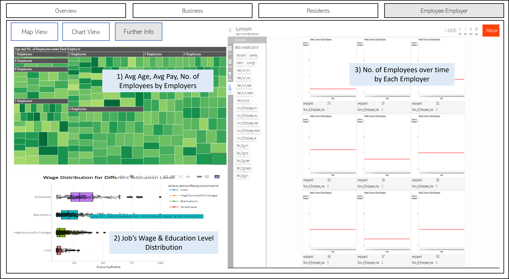

```{r setup, include=FALSE}
knitr::opts_chunk$set(echo = FALSE,
                      warning = FALSE,
                      tidy = FALSE,
                      message = FALSE,
                      fig.align = 'center',
                      out.width = "100%")
```

# Introduction

The first of its kind, this term’s ISSS608 Visual Analytics and Applications course led by Professor Kam Tin Seong builds us towards the highly prestigious IEEE Vast Challenge 2022.

There are 4 challenges provided, targeting different aspects of life in the fictional town Engagement. Our team chose to analyse the Economics of Engagement, and created an interactive dashboard that allows the user to visually analyse the interplay between employee (or residents) and business (or employers) in order to answer the questions: *Over time, are businesses growing or shrinking? How are people changing jobs? Are standards of living improving or declining over time?*.

# Data Preparation

This year, the competition features the fictional town Engagement. We are given a total of 13 datasets comprising information from 2022-03-01T00:00:00Z to 2022-03-04T14:25:00Z about the 1010 participants who reside there. The team used 10 of these datasets for this project, and they are **Participant StatusLogs, Apartments, Buildings, Employers, Jobs, Participants, Pubs, Restaurants, Schools and CheckinJournal**.

We performed data wrangling and transformation to the datasets before loading them in the application. Click here for the code to these steps. 

# Methodology

The application uses various packages such as tidyverse, plotly, ggplot2, lubridate, tmap, sf packages to conduct exploratory data analysis. 

# Features
The app consist of three tabs for users to explore the economy of Engagement City; (1) Businesses, (2) Residents and (3) Employers.  

## Tab 1 - 'Businesses'

Aliquam sed faucibus risus, quis efficitur erat. Vestibulum semper mauris quis tempus eleifend. Aliquam sagittis dictum ipsum, quis viverra ligula eleifend ut. Curabitur sagittis vitae arcu eget faucibus. In non elementum felis. Duis et aliquam nunc. Nunc pulvinar sapien nunc, vel pretium nisi efficitur in. Fusce fringilla maximus leo et maximus. Fusce at ligula laoreet, iaculis mi at, auctor odio. Praesent sed elementum justo. Aenean consectetur risus rhoncus tincidunt efficitur. Praesent dictum mauris at diam maximus maximus [@R-posterdown].


## Tab 2 - 'Residents'

Or with figures: Figure \@ref(fig:standard-plot), or Figure \@ref(fig:morefigs).

```{r standard-plot, out.width='80%', fig.align='center', fig.cap='Great figure!', fig.height=5}
plot(mtcars[1:2])
```


## Tab 3 - 'Employers'

Upon clicking on the 'Employers' tab, the user can further select 3 components to explore. They are (1) Employment Numbers (2) Hiring Rate and (3) Turnover Rate 


**(1) Overview of Employers' Health** From "Employment Numbers" tab, users can study the employment numbers throughout different time period of all the employers in the city via the reactive map and datatable. The map shows the locations, employer ID, average pay given and number of employees they employed.      

<center>

{width=50%}

<center>


**(2) Hiring Rate** From trelliscope, users can filter through the different variables within the chart to explore how the hiring rate varies across different employers at different time period.  


<center>

{width=50%}

<center>

**(2) Turnover Rate** This tab zoomed down to residents that have changed jobs and employers that have changed employees during the study period. The charts separate the employees into different education level and highlight their respective joviality. This allows users to generate insights on relations of other factors to turnover rate.  

<center>

{width=50%}

<center>

# Conclusion

Try `posterdown` out! Hopefully you like it!

```{r, include=FALSE}
knitr::write_bib(c('knitr','rmarkdown','posterdown','pagedown'), 'packages.bib')
```

# References