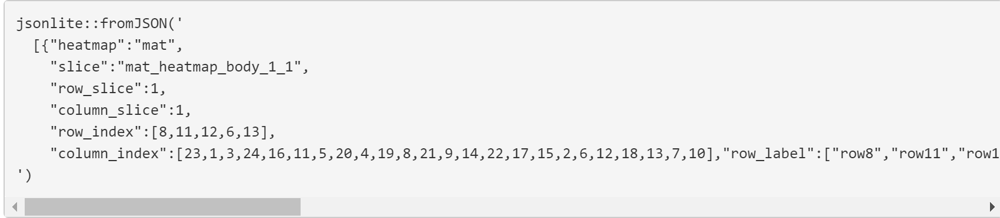

```{r setup, include=FALSE}
knitr::opts_chunk$set(echo = FALSE)
```

*Created this to try out the different Shiny apps.* *Reference: <https://jokergoo.github.io/InteractiveComplexHeatmap/articles/shiny_dev.html#work-with-r-markdown-documents-1>*

```{r}
install.packages("rmarkdown", dep = TRUE)

install.packages("tinytex")
tinytex::install_tinytex()  # install TinyTeX

if (!require("BiocManager", quietly = TRUE))
    install.packages("BiocManager")
BiocManager::install("ComplexHeatmap")
```

```{r}
BiocManager::install("InteractiveComplexHeatmap")
```

```{r}
library(circlize)
```

```{r}
col_fun = colorRamp2(c(-2, 0, 2), c("green", "white", "red"))
col_fun(seq(-3, 3))
```

```{r}
set.seed(123)
nr1 = 4; nr2 = 8; nr3 = 6; nr = nr1 + nr2 + nr3
nc1 = 6; nc2 = 8; nc3 = 10; nc = nc1 + nc2 + nc3
mat = cbind(rbind(matrix(rnorm(nr1*nc1, mean = 1,   sd = 0.5), nr = nr1),
          matrix(rnorm(nr2*nc1, mean = 0,   sd = 0.5), nr = nr2),
          matrix(rnorm(nr3*nc1, mean = 0,   sd = 0.5), nr = nr3)),
    rbind(matrix(rnorm(nr1*nc2, mean = 0,   sd = 0.5), nr = nr1),
          matrix(rnorm(nr2*nc2, mean = 1,   sd = 0.5), nr = nr2),
          matrix(rnorm(nr3*nc2, mean = 0,   sd = 0.5), nr = nr3)),
    rbind(matrix(rnorm(nr1*nc3, mean = 0.5, sd = 0.5), nr = nr1),
          matrix(rnorm(nr2*nc3, mean = 0.5, sd = 0.5), nr = nr2),
          matrix(rnorm(nr3*nc3, mean = 1,   sd = 0.5), nr = nr3))
   )
mat = mat[sample(nr, nr), sample(nc, nc)] # random shuffle rows and columns
rownames(mat) = paste0("row", seq_len(nr))
colnames(mat) = paste0("column", seq_len(nc))
```

```{r}
library(ComplexHeatmap)
library(InteractiveComplexHeatmap)
library(shiny)

# reference = matrix(sample(letters[1:10], 100, replace = TRUE), 10)

print(reference)
ht1 = Heatmap(mat, name = "mat",
    show_row_names = TRUE, show_column_names = FALSE, 
    row_dend_reorder = FALSE, column_title = "no reordering", 
    col = col_fun)
ht1 = draw(ht1)

print(reference)
# ht2 = Heatmap(mat, name = "mat", show_row_names = TRUE, show_column_names = FALSE, row_dend_reorder = TRUE, column_title = "apply reordering", col = col_fun)
ht2 = Heatmap(mat, name = "mat",
    show_row_names = TRUE, show_column_names = FALSE,
    cluster_rows = TRUE, column_title = "apply reordering", 
    col = col_fun)
ht2 = draw(ht2)

ui = fluidPage(
    h3("The first heatmap"),
    InteractiveComplexHeatmapOutput("heatmap_1"),
    hr(),
    h3("The second heatmap"),
    InteractiveComplexHeatmapOutput("heatmap_2")
)
server = function(input, output, session) {
    makeInteractiveComplexHeatmap(input, output, session, ht1, "heatmap_1")
    makeInteractiveComplexHeatmap(input, output, session, ht2, "heatmap_2")
}
shinyApp(ui, server)
```

Pretty awesome. Issue here is that clusters are not apparent.

[*https://rdrr.io/bioc/ComplexHeatmap/man/Heatmap.html*](https://rdrr.io/bioc/ComplexHeatmap/man/Heatmap.html){.uri} There are clustering functions here. [*https://jokergoo.github.io/ComplexHeatmap-reference/book/a-single-heatmap.html#clustering*](https://jokergoo.github.io/ComplexHeatmap-reference/book/a-single-heatmap.html#clustering){.uri} [*https://jokergoo.github.io/ComplexHeatmap-reference/book/a-single-heatmap.html#get-orders-and-dendrograms-from-heatmap*](https://jokergoo.github.io/ComplexHeatmap-reference/book/a-single-heatmap.html#get-orders-and-dendrograms-from-heatmap){.uri}

More references: <https://jokergoo.github.io/ComplexHeatmap-reference/book/a-single-heatmap.html#reorder-dendrograms>

<https://jokergoo.github.io/ComplexHeatmap-reference/book/a-single-heatmap.html#get-orders-and-dendrograms-from-heatmap>

<https://jokergoo.github.io/InteractiveComplexHeatmap/articles/shiny_dev.html#work-with-r-markdown-documents-1>

<https://rdrr.io/bioc/ComplexHeatmap/man/Heatmap.html>

<https://jokergoo.github.io/ComplexHeatmap-reference/book/a-single-heatmap.html#distance-methods>

<https://jokergoo.github.io/ComplexHeatmap-reference/book/a-single-heatmap.html#reorder-dendrograms>

<https://rdrr.io/bioc/ComplexHeatmap/>

<https://www.rdocumentation.org/packages/stats/versions/3.6.2/topics/hclust>

More things to consider: Probably need 2 heatmaps - one for the balance, and another one that lets us plot heatmaps (based on categories) by inputting the members that fall within the cluster.



Perhaps can make use of the row_index output to input into the accounts in the cluster heatmap.

Actually maybe not needed to automate. Would be better if we just allow the user to add the related accounts manually.

#Another try

Getting the data we need

```{r}
usethis_balance_without_participant_id_v3 <- read_csv("data/usethis_balance_without_participant_id_v3.csv")
usethis_balance_without_participant_id_2_day_window <- read_csv("data/usethis_balance_without_participant_id_2_day_window")
usethis_balance_without_participant_id_3_day_window <- read_csv("data/usethis_balance_without_participant_id_3_day_window")
usethis_balance_without_participant_id_4_day_window <- read_csv("data/usethis_balance_without_participant_id_4_day_window")
usethis_balance_without_participant_id_5_day_window <- read_csv("data/usethis_balance_without_participant_id_5_day_window")
usethis_balance_without_participant_id_6_day_window <- read_csv("data/usethis_balance_without_participant_id_6_day_window")
usethis_balance_without_participant_id_7_day_window <- read_csv("data/usethis_balance_without_participant_id_7_day_window")
usethis_balance_without_participant_id_15_day_window <- read_csv("data/usethis_balance_without_participant_id_15_day_window")
usethis_balance_without_participant_id_25_day_window <- read_csv("data/usethis_balance_without_participant_id_25_day_window")

```

```{r}
library(ComplexHeatmap)
library(InteractiveComplexHeatmap)
library(shiny)

#usethis_balance_without_participant_id_v3
ht1 = Heatmap(usethis_balance_without_participant_id_v3, name = "balance",
    show_row_names = FALSE, show_column_names = FALSE,
    cluster_rows = TRUE, cluster_columns = FALSE, 
    column_title = "apply reordering", 
    show_column_dend = FALSE, show_row_dend = FALSE)

#usethis_balance_without_participant_id_2_day_window
ht2 = Heatmap(usethis_balance_without_participant_id_2_day_window, name = "balance",
    show_row_names = FALSE, show_column_names = FALSE,
    cluster_rows = TRUE, cluster_columns = FALSE, 
    column_title = "apply reordering", 
    show_column_dend = FALSE, show_row_dend = FALSE)

#usethis_balance_without_participant_id_3_day_window
ht3 = Heatmap(usethis_balance_without_participant_id_3_day_window, name = "balance",
    show_row_names = FALSE, show_column_names = FALSE,
    cluster_rows = TRUE, cluster_columns = FALSE, 
    column_title = "apply reordering", 
    show_column_dend = FALSE, show_row_dend = FALSE)

#usethis_balance_without_participant_id_4_day_window
ht4 = Heatmap(usethis_balance_without_participant_id_4_day_window, name = "balance",
    show_row_names = FALSE, show_column_names = FALSE,
    cluster_rows = TRUE, cluster_columns = FALSE, 
    column_title = "apply reordering", 
    show_column_dend = FALSE, show_row_dend = FALSE)

#usethis_balance_without_participant_id_5_day_window
ht5 = Heatmap(usethis_balance_without_participant_id_5_day_window, name = "balance",
    show_row_names = FALSE, show_column_names = FALSE,
    cluster_rows = TRUE, cluster_columns = FALSE, 
    column_title = "apply reordering", 
    show_column_dend = FALSE, show_row_dend = FALSE)

#usethis_balance_without_participant_id_6_day_window
ht6 = Heatmap(usethis_balance_without_participant_id_6_day_window, name = "balance",
    show_row_names = FALSE, show_column_names = FALSE,
    cluster_rows = TRUE, cluster_columns = FALSE, 
    column_title = "apply reordering", 
    show_column_dend = FALSE, show_row_dend = FALSE)

#usethis_balance_without_participant_id_7_day_window
ht7 = Heatmap(usethis_balance_without_participant_id_7_day_window, name = "balance",
    show_row_names = FALSE, show_column_names = FALSE,
    cluster_rows = TRUE, cluster_columns = FALSE, 
    column_title = "apply reordering", 
    show_column_dend = FALSE, show_row_dend = FALSE)

#usethis_balance_without_participant_id_15_day_window
ht15 = Heatmap(usethis_balance_without_participant_id_15_day_window, name = "balance",
    show_row_names = FALSE, show_column_names = FALSE,
    cluster_rows = TRUE, cluster_columns = FALSE, 
    column_title = "apply reordering", 
    show_column_dend = FALSE, show_row_dend = FALSE)

#usethis_balance_without_participant_id_25_day_window
ht25 = Heatmap(usethis_balance_without_participant_id_25_day_window, name = "balance",
    show_row_names = FALSE, show_column_names = FALSE,
    cluster_rows = TRUE, cluster_columns = FALSE, 
    column_title = "apply reordering", 
    show_column_dend = FALSE, show_row_dend = FALSE)

ui = fluidPage(
    h3("The first heatmap"),
    InteractiveComplexHeatmapOutput("heatmap_1"),
    h3("The second heatmap"),
    InteractiveComplexHeatmapOutput("heatmap_2")
)
server = function(input, output, session) {
    makeInteractiveComplexHeatmap(input, output, session, ht1, "heatmap_1")
    makeInteractiveComplexHeatmap(input, output, session, ht2, "heatmap_2")
}
shinyApp(ui, server)
```